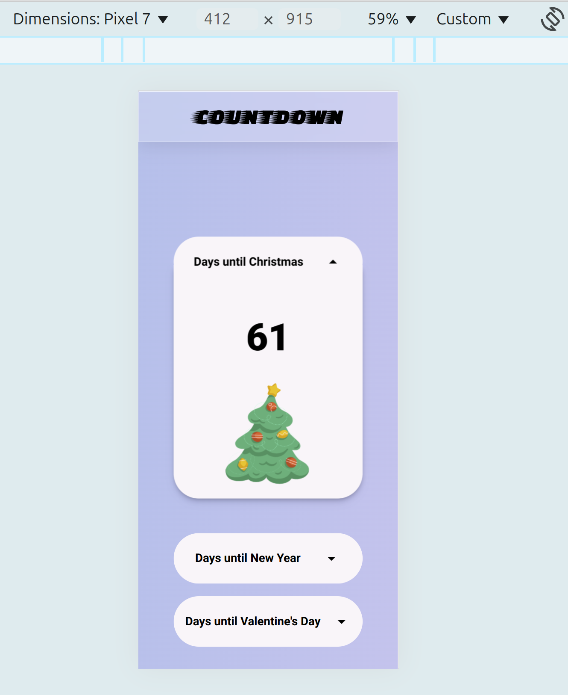
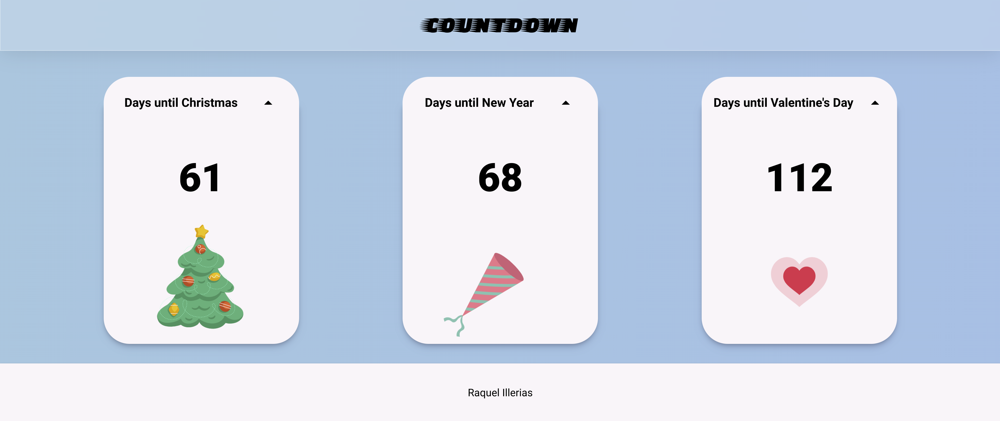

# Dynamic Countdown with Animations

This project is a dynamic countdown built using HTML, Sass, and JavaScript. The countdown dynamically updates and includes animations that trigger on both page load and user interaction. The code is structured with clean and reusable coding practices to ensure maintainability and scalability.

## Project Setup

### Installation

Inside the folder **BIS-CODING-TASKS**, open the terminal and run the following command:

```bash
npm install
```

### Run the project

Inside the folder **BIS-CODING-TASKS**, open the terminal and run the following command:

```bash
npm run sass
```

## Features

- **Dynamic Countdown**: The countdown updates in real-time, displaying the number of days remaining until a specified event.

- **Page Load Animations**: When the page loads, the header, countdown, and footer are sequentially animated.

- **User Interaction Animations**: Clicking on any of the expandable countdown elements triggers additional animations.

## Technologies Used

- **HTML**: For the basic structure of the web page.
- **Sass**: For enhanced CSS management with variables, mixins, and reusable styles.
- **JavaScript**: For dynamic countdown updates and controlling animations.

## Live site screenshots

- **Mobile screen size**

  

- **Desktop screen size**

  
